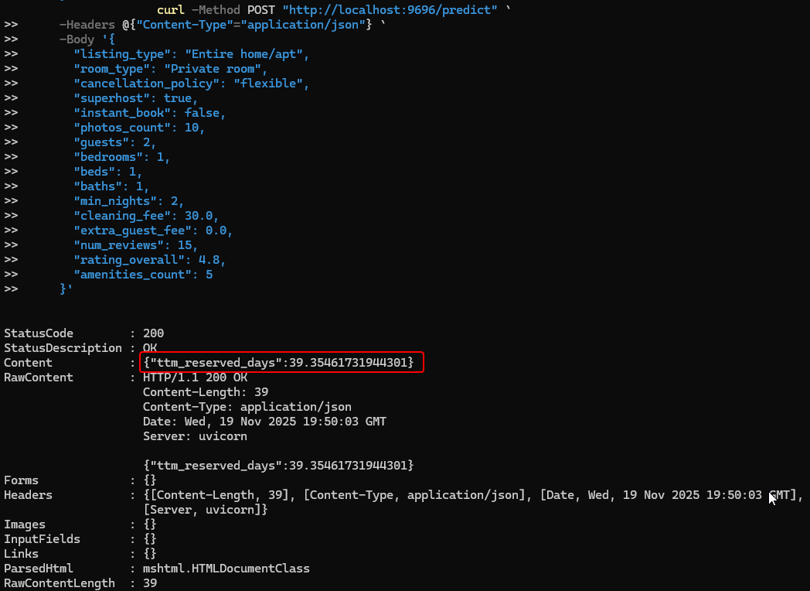
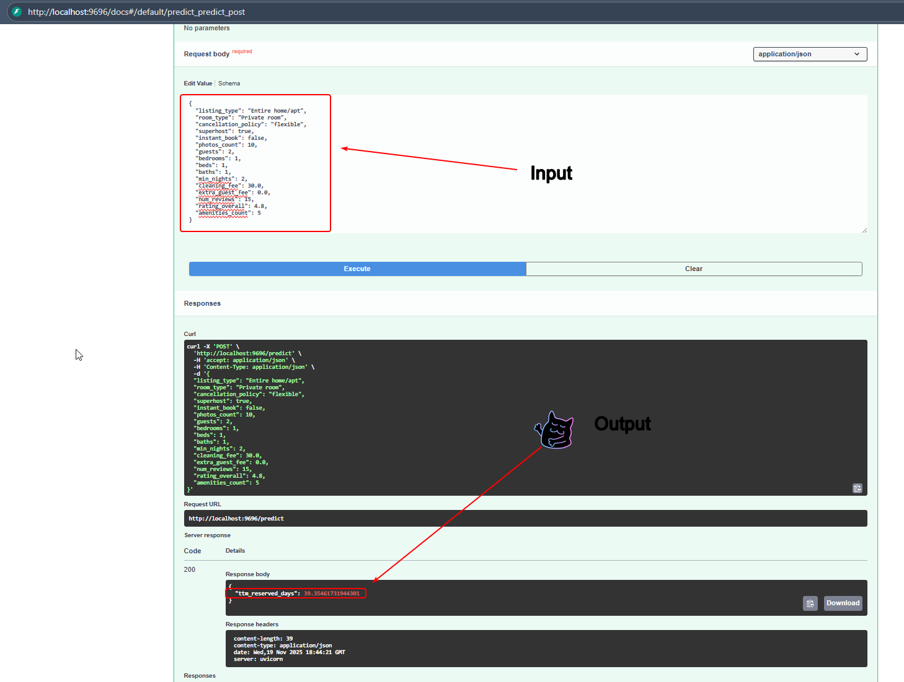

# Airbnb Mexican Beaches Analysis

## Dataset Summary
This project uses Airbnb listing data from 18 Mexican beach cities, with each city represented by a separate CSV file in the `data/` directory. The combined dataset contains thousands of samples and dozens of features describing each listing, such as property type, room type, amenities, host status, reviews, and more.

## Target Prediction
The main goal is to predict the **Number of booked/reserved days in trailing twelve months** (`ttm_reserved_days`) for each listing. This target helps estimate how often a property is booked over the past year, which is valuable for hosts and investors.

## Model Usage
A machine learning model (such as Gradient Boosting, Random Forest, or Ridge Regression) is trained using descriptive features of each listing. The model can be used to:
- **Estimate future bookings** for new or existing listings
- **Support investment decisions** by predicting occupancy
- **Optimize listing features** to improve booking rates

## Setup and Running the Project

### 1. Initialize the `uv` Environment
First, create a virtual environment using `uv`:
```bash
uv venv
```
Next, activate the environment.

**On Windows:**
```powershell
.venv\Scripts\Activate.ps1
```

**On macOS and Linux:**
```bash
source .venv/bin/activate
```

### 2. Install Dependencies
With the environment activated, install the required packages:
```bash
uv pip install -r requirements.txt
```

### 3. Data preprocessing, EDA and model selection.
Instead of jupyter notebooks I used marimo notebooks. To see it just run the following command in your terminal.
```bash
marimo edit notebook.py
```
But I also published it in [marimo service](https://static.marimo.app/static/midtermprojectmachinelearningzoomcamp-h2jp)

### 4. Run the Scripts in Terminal

**To train the model:**
Run the `train.py` script to process the data and train the model. This will create a `gradient_boosting_model.bin` file.
```bash
python train.py
```

**To start the prediction server:**
Run the `predict.py` script using `uvicorn`. This will start a local server for making predictions.
```bash
python predict.py
```

## API Usage

You can interact with the prediction API in two ways:

### 1. Using PowerShell and CURL

```powershell
curl -X POST "http://localhost:8000/predict" -H "Content-Type: application/json" -d '{
    "listing_type": "Entire home/apt",
    "room_type": "Entire home/apt",
    "cancellation_policy": "flexible",
    "superhost": true,
    "instant_book": false,
    "photos_count": 10,
    "guests": 4,
    "bedrooms": 2,
    "beds": 2,
    "baths": 1,
    "min_nights": 2,
    "cleaning_fee": 0,
    "extra_guest_fee": 0,
    "num_reviews": 5,
    "rating_overall": 4.8,
    "amenities_count": 12
}'
```


### 2. Using Swagger UI

Open your browser and go to [http://localhost:8000/docs](http://localhost:8000/docs). You can interact with the API using the interactive documentation, try out requests, and see responses directly in the browser.



#### Example JSON payload for the POST request using Swagger UI

```json
{
  "listing_type": "Entire home/apt",
  "room_type": "Entire home/apt",
  "cancellation_policy": "flexible",
  "superhost": true,
  "instant_book": false,
  "photos_count": 10,
  "guests": 4,
  "bedrooms": 2,
  "beds": 2,
  "baths": 1,
  "min_nights": 2,
  "cleaning_fee": 0,
  "extra_guest_fee": 0,
  "num_reviews": 5,
  "rating_overall": 4.8,
  "amenities_count": 12
}
```

---
For more details, see the code in `notebok.py`, `train.py` and `predict.py`.
